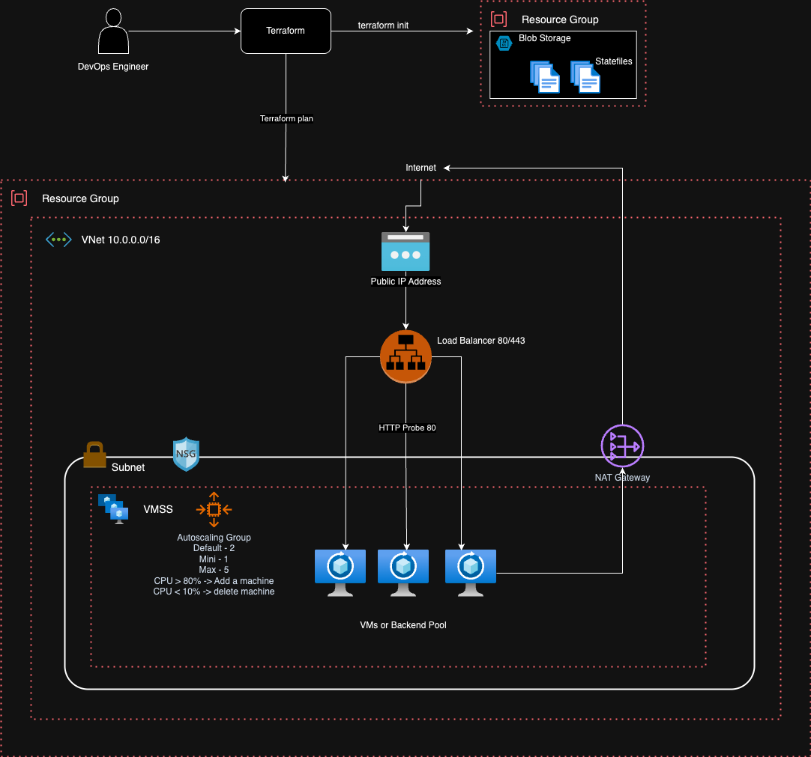

# Terraform-Azure-Infrastructure-Project

## Action Plan

1. Create NSG -> Attach to Subnet
    - Attach the rule that only LB can access the backend pool i.e. only allow incoming traffic from the LB to VMSS (backend pool)

2. Assign the ScaleIn and ScaleOut rules to the AutoScaling Group

3. Set env for everything

4. Use locals wherever possible to make the code manageable

5. Use Dyanmic blocks for NSG

6. Use map for VM size based on the env name

7. Every resource should have tag "modified_on" which should have the value of the current timestamp - YYYY-MM-DD    

